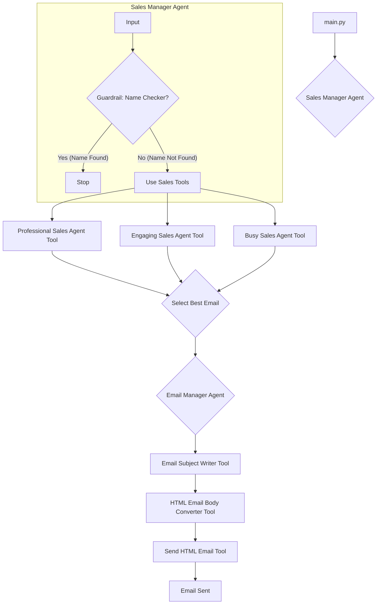

This project implements an automated Sales Development Representative (SDR) system. It leverages multiple AI agents to generate, evaluate, and send personalized cold sales emails. The system orchestrates various agents and tools to streamline the outbound sales process, from drafting compelling messages to handling email delivery.

## Sales Project Architecture Flowchart

